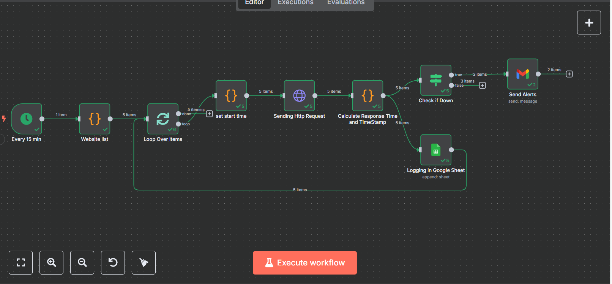
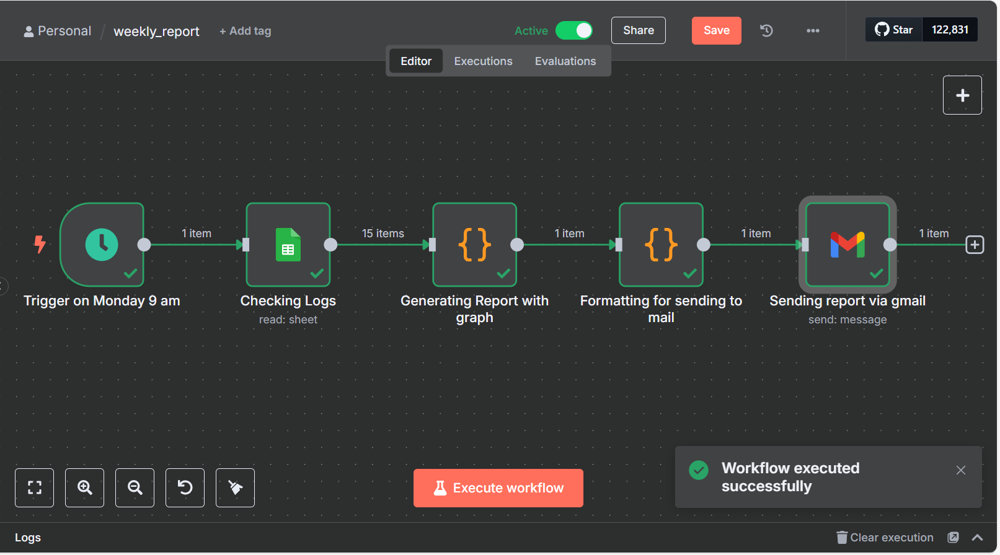

# Automated Website Uptime Monitoring & Reporting System

## 🚀 Project Overview

This project implements a robust and automated system for monitoring website uptime and performance, built using **n8n**, a powerful open-source workflow automation tool. It ensures continuous oversight of web assets, provides instant alerts for downtime, and generates comprehensive weekly performance reports.

### ✨ Key Features

* **Real-Time Monitoring:** Automated checks of specified websites every 15 minutes.
* **Performance Tracking:** Captures HTTP status code, response time (in milliseconds), and error messages for each check.
* **Instant Email Alerts:** Immediate notifications sent via email when any monitored site is detected as down (non-200 HTTP status code or timeout).
* **Historical Data Logging:** All monitoring results are systematically logged to a Google Sheet for historical analysis.
* **Automated Weekly Reporting:** Generates and emails a detailed performance summary every Monday at 9 AM IST, including:
    * Overall uptime percentage per website.
    * Average response time per website.
    * Number of downtime incidents.
    * "Longest downtime" (approximated by highest response time).
    * Visual response time trend charts for each website (via QuickChart.io).
* **Sequential Processing:** Ensures websites are checked one by one to avoid overwhelming servers and maintain accurate individual timing.
* **Modular and Extensible:** Easily update the list of monitored websites or alert recipients.

## ⚙️ Workflows

The system consists of two interconnected n8n workflows:

### 1. Website Monitoring Workflow

**Purpose:** Routinely checks each website, logs the results, and sends instant alerts if a failure is detected.

**High-Level Flow:**

`Cron Trigger (Every 15 min)`
  ➡️ `Code: Website List` (Defines URLs)
    ➡️ `Split In Batches: Loop Over Items` (Processes one URL at a time)
      ➡️ `Code: Set Start Time` (Records timestamp before HTTP request)
        ➡️ `HTTP Request1` (Pings the website)
          ➡️ `Code: Compute Response Time` (Calculates duration, determines status, consolidates data)
            ➡️ `If: Check if Down` (Branches based on HTTP status code)
              ➡️ `True (Down)`: `Gmail: Send Alert` (Emails alert)
              ➡️ `False (Up)`: (Connects to Google Sheets for logging)
            ➡️ `Google Sheets4: Log to Sheet` (Logs all check results)

**Visual Overview:**

**N8N Workflow File:**
The complete JSON export for this workflow is available in the repository as `monitoring_workflow.json`.

---

### 2. Weekly Reporting Workflow

**Purpose:** Aggregates all logged data for the past week, summarizes it, and emails a detailed weekly health report with trend charts.

**High-Level Flow:**

`Cron Trigger (Every Monday 9 AM IST)`
  ➡️ `Google Sheets1: Fetch Log Data` (Reads all monitoring logs)
    ➡️ `Code2: Data Aggregation` (Calculates stats, generates chart URL)
      ➡️ `Code4: Email Report Generator` (Composes HTML email body)
        ➡️ `Gmail: Send Report` (Dispatches the weekly report)

**Visual Overview:**

**N8N Workflow File:**
The complete JSON export for this workflow is available in the repository as `weekly_report.json`.

---

## 🛠️ Manual Configuration & Integrations (Crucial Steps!)

To make these workflows functional, you **must** configure Google OAuth 2.0 credentials in the Google Cloud Console and set them up in n8n.

### 1. Google Sheets & Gmail Integration (Google OAuth2)

This process grants n8n authorized access to your Google services (Sheets for logging/reading, Gmail for sending emails).

#### Steps in Google Cloud Console:

1.  **Go to Google Cloud Console:**
    * Navigate to [https://console.cloud.google.com/](https://console.cloud.google.com/) and log in with your Google Account.
    * **Create a new project** if you don't have one (e.g., "n8n Website Monitor").

2.  **Enable Required APIs:**
    * In the Google Cloud Console search bar, find and enable:
        * **Google Sheets API** (for reading/writing to Google Sheets)
        * **Gmail API** (for sending emails)
    * Click "Enable" for both.

3.  **Configure OAuth Consent Screen:**
    * Navigate to **APIs & Services > OAuth consent screen**.
    * Choose **"External"** (unless you are a Google Workspace user). Click "Create".
    * Provide **Application Name** (e.g., "n8n Website Monitor"), **User support email**, and **Developer contact information**. Click "Save and Continue".
    * **Scopes:** Click "Add or Remove Scopes".
        * For Google Sheets: Search for `../auth/spreadsheets` and select `.../auth/spreadsheets`.
        * For Gmail: Search for `../auth/gmail.send` and select `.../auth/gmail.send`.
        * Click "Update".
    * Click "Save and Continue".
    * **Test Users:** If your app is "In production", add your Google Account as a test user. If "In testing", you can proceed. Review and go back to the Dashboard.

4.  **Create OAuth Client ID:**
    * Navigate to **APIs & Services > Credentials**.
    * Click **"+ CREATE CREDENTIALS" > "OAuth client ID"**.
    * **Application type:** Select **"Web application"**.
    * **Name:** Give it a descriptive name (e.g., "n8n-web-app-credentials").
    * **Authorized redirect URIs:** Add your n8n instance's OAuth callback URL:
        * `YOUR_N8N_URL/rest/oauth2-credential/callback`
        * *(e.g., `http://localhost:5678/rest/oauth2-credential/callback` if running locally, or your public n8n URL)*
    * Click "Create".
    * **Copy your Client ID and Client Secret immediately!** These are essential for n8n.

#### Steps in n8n:

1.  **Add New Credential in n8n:**
    * In your n8n instance, go to **Credentials** (left sidebar).
    * Click **"New Credential"**.
    * Search for and select **"Google OAuth2 API"**.
    * Paste your **Client ID** and **Client Secret**.
    * Click **"Connect"**. A pop-up window will appear for Google Account login and permission granting.
    * **Authorize Access:** Select your Google Account and grant the requested permissions (Sheets and Gmail).
    * Once authorized, the credential will be saved. Give it a descriptive name (e.g., "My Google Account OAuth").

2.  **Configure Google Sheets & Gmail Nodes in Workflows:**
    * In both your "Website Monitoring" and "Weekly Report" workflows, for all "Google Sheets" and "Gmail" nodes, select the Google OAuth2 credential you just created in the "Credential" field.

### 2. Google Sheet Format

Ensure your Google Sheet (e.g., named "Website Monitoring Log") has the following exact column headers for correct data logging and reporting:

| Websites URLs     | Status | Response Time (ms) | Timestamp               | Error Message     | Content Length |
| :---------------- | :----- | :----------------- | :---------------------- | :---------------- | :------------- |
| `https://cnn.com` | `Up`   | `142`              | `23/07/2025, 09:00:12 AM` |                   | `12345`        |
| `https://irctc.co.in` | `Down` | `0`                | `23/07/2025, 09:00:12 AM` | `Request Timeout` |                |

### 3. Timezone Awareness

* For all `Cron Trigger` nodes in both workflows, set the **Timezone** parameter to `Asia/Kolkata` (or your desired timezone) to ensure accurate scheduling.

### 4. QuickChart.io

* No manual setup or account is required for QuickChart.io. The "Code2" node in the weekly report workflow dynamically generates a chart image URL, which is then embedded directly into the HTML email.

---

## 🚀 Usage

1.  **Import Workflows:** Import `monitoring_workflow.json` and `weekly_report.json` into your n8n instance.
2.  **Configure Credentials:** Follow the "Manual Configuration" steps above to set up your Google OAuth2 credentials in n8n and link them to the relevant nodes.
3.  **Activate Workflows:** Enable both workflows in n8n.
    * The "Website Monitoring" workflow will start running every 15 minutes.
    * The "Weekly Reporting" workflow will run every Monday at 9 AM IST.
4.  **Monitor & Review:**
    * Check your Google Sheet for continuous logging of website status.
    * Expect email alerts for any detected website downtime.
    * Receive a comprehensive performance report in your inbox weekly.

---

## 💡 Additional Notes & Considerations

* **IRCTC Specifics:** Be aware that some high-security sites like `irctc.co.in` might block or rate-limit automated requests, potentially leading to expected "Down" results in logs. This serves as a good test for the workflow's error handling.
* **Response Time vs. Downtime:** High response time indicates performance degradation, while "Down" is specifically defined by a non-200 HTTP status code.
* **Extensibility:** The table and chart data in the reports are extensible; you can add more columns or metrics (e.g., content verification, SSL certificate expiry) as your needs evolve.
* **Security:** Always keep sensitive OAuth credentials securely stored within n8n's encrypted credential store.

---

**Author:** Harshit Vishnoi 
